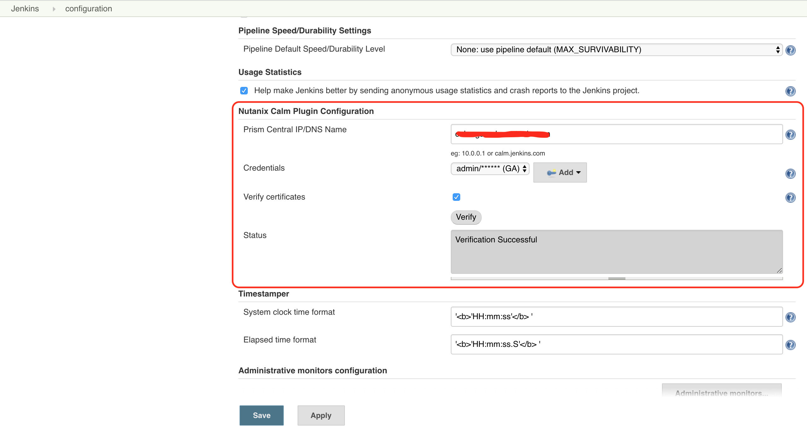

# Nutanix Calm Plugin
Nutanix Calm Jenkins plugin allows you to launch Nutanix Calm blueprint, provision infrastructure, and services in a multi cloud environment and subsequently run actions/tasks on those applications.

#### License:
* All source code is licensed under the MIT license.

#### Supported Versions:
* Jenkins versions: 2.107.2 and later
* Nutanix Calm versions: 5.7.1 and later
* Google Chrome version:  69.0.3497.100 (Official Build) (64-bit)

#### Plugin Installation:
* Navigate to Manage Jenkins→ Manage Plugins → Available.  Search for Nutanix Calm.
  
* To verify that the Nutanix Calm plug-in is successfully installed, click Manage Jenkins→ Manage Plugins→ Installed search for Nutanix Calm plugin.
  

#### Plugin Configuration:
* To configure the plugin first Navigate to Manage Jenkins -> Configure System -> Nutanix Calm Plugin Configuration. Provide the Prism Central IP/DNS Name, Username and Password.
  

#### Jenkins Freestyle job Setup:
* Click on New Item.Select Freestyle project. Enter an item name. Click OK.
  
  
* Click on Add Build step. Select **Nutanix Calm Blueprint Launch**.
  
* In the section
    * Select the Calm project.
    * Select the Blueprint to launch. Blueprint description is fetched and displayed.
    * Select the Application profile.
    * Modify the values for runtime variables available for that application profile.
    * Provide an application name. BUILD_ID is appended by default to the application name to uniquely identify it in Calm.
    * Select the option if you want Jenkins job to wait for blueprint launch to complete before proceeding to the next step.
      
* To invoke actions defined in the Calm blueprint/ application, click on Add Build Step. Select **Nutanix Calm Application Action Run**.
  
* In the section
    * Select the application name.
    * Select the application actions available.
    * If necessary, modify the values for the runtime variables available.
      
    * Click on Apply and then Save.
    * Now we can click on **Build Now** to run these build steps and then we can check the console output for this build.
    * 

#### Jenkins Pipeline:
* Click on New Item. Select Pipeline. Enter an item name. Click OK.
  
  
* Select pipeline script in Pipeline Definition section and to generate the pipeline syntax click on the Pipeline Syntax at the bottom.
  
* In the Pipeline Syntax window, select the General build Step in the Sample step dropdown.
  * Select Nutanix Calm Blueprint Launch in Build Step
* In the section
    * Select the Calm project.
    * Select the Blueprint to launch. Blueprint description is fetched and displayed.
    * Select the Application profile.
    * Modify the values for runtime variables available for that application profile.
    * Provide an application name. BUILD_ID is appended by default to the application name to uniquely identify it in Calm.
    * Select the option if you want Jenkins job to wait for blueprint launch to complete before proceeding to the next step.
    * Click on Generate Pipeline Script.
      
* Copy and paste the text in the box below into the pipeline script box in **{}** under node.
  
* Follow same steps to generate the pipeline syntax for **Nutanix Calm Application Action Run**.
  
* Copy and paste the text in the box below into the pipeline script box in **{}** under node.
  
* Click on Apply and then Save.
* Now we can click on **Build Now** to run these build steps and then we can check the console output for this build.
* 

* We can also use Pipeline script from SCM in Pipeline Definition section
  

* Please find the below mentioned pipeline/jenkinsfile syntax for our reference for **Nutanix Calm Blueprint Launch** and **Nutanix Calm Application Action Run** build steps.
* We can copy paste the required pipeline build step script from **Pipeline Syntax** or we can use below mentioned syntax for the same.
    * Nutanix Calm Blueprint Launch
    > step([$class: 'BlueprintLaunch', appProfileName: '**&lt;Enter Application Profile name&gt;**', applicationName: '**&lt;Enter application name&gt;**_${BUILD_ID}', blueprintDescription: '**&lt;Enter blueprint description&gt;**', blueprintName: '**&lt;Enter blueprint name&gt;**', projectName: '**&lt;Enter project name&gt;**', runtimeVariables: '''{
          "**&lt;key&gt;**": "**&lt;value&gt;**"
      }''', waitForSuccessFulLaunch: **&lt;Enter true or false&gt;**])

    * Nutanix Calm Application Action Run
    > step([$class: 'RunApplicationAction', actionName: '**&lt;Enter Action name&gt;**', applicationName: '**&lt;Enter application name&gt;**_${BUILD_ID}', runtimeVariables: '''{
          "**&lt;key&gt;**": "**&lt;value&gt;**"
      }'''])

    * NOTE: We need to put the required build steps pipeline script in **node{}** for pipeline/jenkinsfile invocation.

